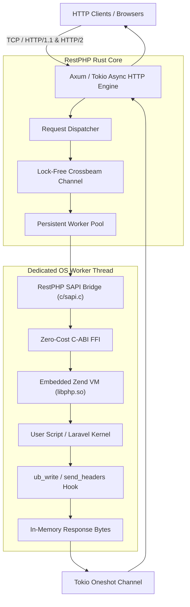

# RestPHP 🦀🐘

> **The Blazing-Fast, Persistent Application Server & Runtime for PHP powered by Rust.**  
> A Rust-hosted PHP runtime with a custom Zend SAPI bridge. Production hardening is in progress.

[](LICENSE)
[](https://www.php.net/)
[](https://www.rust-lang.org/)
[](https://arsyadal.github.io/restphp/)

📖 **Official Documentation**: [https://arsyadal.github.io/restphp/](https://arsyadal.github.io/restphp/)

---

## ⚡ Why RestPHP?

Traditional PHP operates on a **shared-nothing architecture**: every incoming HTTP request boots the entire framework from scratch and tears down memory afterwards. While persistent runners like **FrankenPHP (Go)** and **RoadRunner (Go)** pioneered worker mode, they face hard limits imposed by the Go runtime:

1. **Zero-Cost FFI vs Cgo**: FrankenPHP must pass through Go's `cgo` layer to talk to Zend Engine, paying a stack-switching penalty on every single FFI transition (~60ns). RestPHP links directly to the Zend C ABI via Rust's zero-cost FFI.
2. **Deterministic Latency (Zero Host GC)**: FrankenPHP runs two concurrent garbage collectors (Go GC + Zend GC), causing unpredictable latency spikes at p99/p99.9. RestPHP has **no host GC**—memory is deterministically managed by Rust's RAII model.
3. **In-Memory Zero-Copy Streaming**: Network socket buffers from Tokio / Axum are passed directly into PHP's request stream without duplicate heap allocations or IPC pipe serialization.

---

## 📊 Architectural comparison

RestPHP's performance figures are not yet independently validated across identical workloads and deployment environments. Reproduce the published benchmark methodology before making production capacity decisions.

| Dimension / Feature | **Nginx + PHP-FPM** | **RoadRunner (Go)** | **FrankenPHP (Go)** | **Swoole (C++)** | 🦀 **RestPHP (Rust)** |
| :--- | :--- | :--- | :--- | :--- | :--- |
| **Language Runtime** | C | Go | Go (via Caddy) | C++ | **Rust 2021 (Zero-Cost)** |
| **Execution Model** | Cold boot per req | Persistent Worker | Persistent Worker | Coroutine Event Loop | **Persistent Worker (Actor)** |
| **PHP Binding Method** | FastCGI TCP/Unix socket | IPC Pipes / Protobuf | `cgo` (stack switch cost) | PHP C Extension | **Zero-Cost C-ABI (`extern "C"`)** |
| **Host Garbage Collection** | None | Go GC (Stop-the-World) | Go GC + PHP GC (**Double GC**) | Manual C++ | **Zero Host GC (Compile-time RAII)** |
| **Tail Latency (p99)** | Varies by workload | Varies by workload | Varies by workload | Varies by workload | **Pending reproducible benchmark** |
| **Base Memory Footprint** | Varies by workload | Varies by workload | Varies by workload | Varies by workload | **Pending reproducible benchmark** |
| **Throughput (RPS)** | Varies by workload | Varies by workload | Varies by workload | Varies by workload | **Pending reproducible benchmark** |
| **Async I/O Engine** | epoll | Go netpoller | Go netpoller | Custom epoll/kqueue | **Tokio / Axum (Zero-copy)** |
| **PHP Extension Compatibility** | Varies | Varies | Varies | Varies | **Native Zend embedding; compatibility matrix pending** |
| **Host Memory Safety** | C (leaks/overflows) | Safe (Go runtime) | Safe (Go runtime) | ⚠️ Segfault / Leak risks | **100% Memory Safe (Borrow Checker)** |
| **Single Binary CLI** | ❌ Needs Nginx + FPM | ✅ Single Binary (`rr`) | ✅ Single Binary | ❌ Needs `.so` extension | **✅ Single Static Binary (`restphp`)** |
| **Laravel Octane boot-once support** | ❌ No | ✅ Yes | ✅ Yes | ✅ Yes | **⚠️ Not yet supported** |

---

## 📦 Installation

### Option 1: One-Line Install Script (Recommended)

```bash
curl -fsSL https://restphp.dev/install.sh | bash
```

Verify your installation:

```bash
restphp --version
# Output: restphp 0.1.0
```

### Option 2: Build from Source with Cargo

Ensure you have `php-dev` and build essentials installed:

```bash
# Ubuntu / Debian
sudo apt-get install -y build-essential libphp-embed php-dev pkg-config clang

# Clone and compile
git clone https://github.com/arsyadal/restphp.git
cd restphp
cargo build --release

# Install binary to /usr/local/bin
sudo cp target/release/restphp /usr/local/bin/
```

---

## 🚀 Quickstart (Bun-Style Simplicity)

### 1. Zero-Config Instant Startup

```bash
# Just run restphp — auto-detects Laravel, public/index.php, or index.php!
restphp

# Run any script directly on a custom port
restphp app.php -p 3000

# Evaluate inline PHP directly from terminal
restphp -e 'echo "Hello from RestPHP!\n";'
```

### 2. Laravel applications

RestPHP can serve a Laravel application's `public/index.php` through its standard request lifecycle. The `restphp/octane` package is present as an experimental adapter, but boot-once Octane persistence is not yet supported; do not use it for production workloads.

### 3. Evaluate Inline PHP Code

```bash
restphp -e 'echo "PHP Version: " . PHP_VERSION . "\n";'
```

---

## 🏗️ Architecture Overview



---

## 🗺️ Project Roadmap

- [x] **Milestone 1**: Zend Engine C-FFI Core Embedding (Verified in memory)
- [x] **Milestone 2**: Custom SAPI Implementation (`ub_write`, `send_headers`, superglobals)
- [x] **Milestone 3**: Async Tokio HTTP Server & REST routing (Verified with live `curl`)
- [ ] **Milestone 4 follow-up**: Production lifecycle hardening and a real Laravel Octane boot-once bridge.
- [x] **Milestone 5**: Micro-benchmarks vs FrankenPHP, TechEmpower configs, Hot Reload & VitePress Docs ([`benchmarks/`](benchmarks/))

See [`ROADMAP.md`](ROADMAP.md) for granular task tracking.

---

## 📜 License

Dual licensed under MIT OR Apache-2.0.  
Authored by [Arsyad Alghital](https://github.com/arsyadal).
