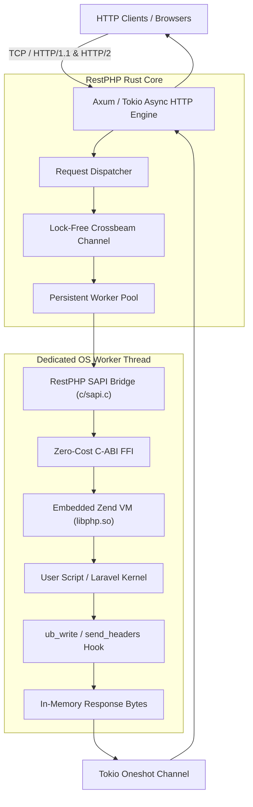

# Architecture Overview

RestPHP combines the raw speed and memory safety of **Rust** with the ubiquity and flexibility of the **PHP Zend Engine**.

---

## High-Level Architecture

---

## The Four Core Pillars

### 1. Zero-Cost C-FFI Layer (`src/ffi/`)
RestPHP directly interfaces with `libphp.so` using Rust's `extern "C"` declarations:
- Symbol linkage is verified at build time via `build.rs` and `php-config`.
- Function calls execute at zero additional latency (~0ns) compared to native C calls.

### 2. Custom SAPI Subsystem (`src/sapi/` and `c/sapi.c`)
Standard PHP communicates with web servers through Server Application Programming Interfaces (SAPIs). RestPHP registers a dedicated `restphp` SAPI:
- **`ub_write`**: Intercepts `echo`, `print`, and raw HTML, streaming output directly into Rust byte buffers without hitting standard OS stdout.
- **`send_headers`**: Intercepts HTTP response codes and headers set by PHP `header()`.
- **`read_post`**: Streams inbound HTTP POST/PUT bodies iteratively in chunks into PHP's request reader.
- **`read_cookies`**: Supplies raw HTTP cookie strings to Zend's internal parser.

### 3. Asynchronous Tokio HTTP Engine (`src/server.rs`)
- Powered by **Tokio** and **Axum**.
- Capable of sustaining tens of thousands of concurrent open TCP connections.
- Converts incoming Axum requests into lightweight `WorkerJob` envelopes dispatched across lock-free channels.

### 4. Dedicated Persistent Worker Actors (`src/worker.rs`)
- Because the standard PHP engine in NTS mode is not thread-safe, each worker runs in its own **dedicated OS thread**.
- Workers maintain persistent Zend VM instances, running `php_request_startup()` -> handle -> `php_request_shutdown()` with full bailout protection (`zend_first_try` / `zend_catch`).
