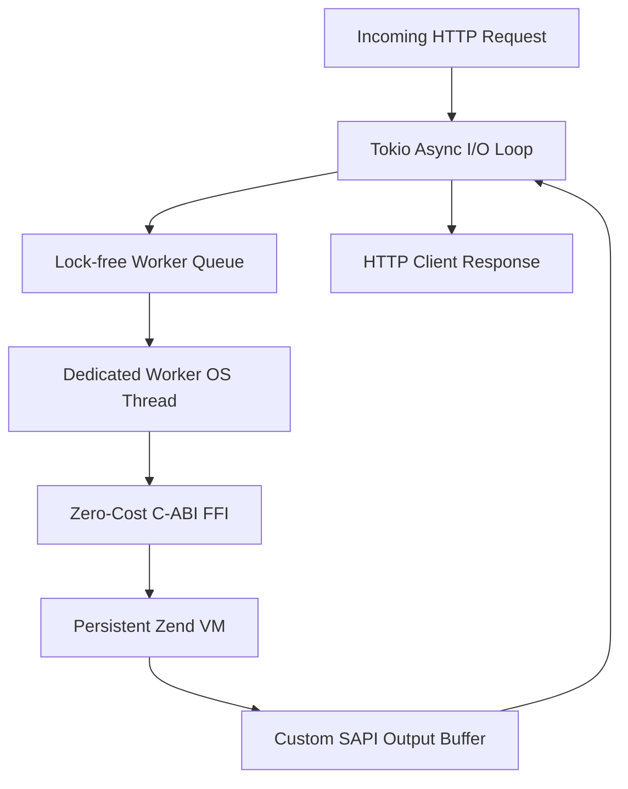

# What is RestPHP?

**RestPHP** is a modern, ultra-high-performance persistent application server and runtime for PHP, written in Rust.

---

## The Problem with Traditional PHP Hosting

For decades, the standard way to deploy PHP applications has been **Nginx + PHP-FPM (FastCGI)** or Apache with `mod_php`.

In this model:
1. Every incoming HTTP request initiates a **cold boot**.
2. PHP loads the autoloader, thousands of framework files (Laravel/Symfony), compiles them to opcodes, boots service providers, and sets up routes.
3. Once the HTTP response is sent, the entire Zend VM instance and process memory are **destroyed**.
4. The next request repeats the entire process from scratch.

Even with OPcache, **70% to 80% of request time is spent re-bootstrapping the framework**, severely limiting raw throughput to a few hundred requests per second.

---

## Enter Persistent PHP: The Go Era & Its Limits

In recent years, tools like **FrankenPHP** and **RoadRunner** introduced persistent workers to PHP by writing servers in Go:
- The PHP application is loaded into RAM once.
- Requests are handled persistently without reloading files.

However, writing a persistent PHP runtime in Go comes with fundamental architectural penalties:

### 1. The `cgo` Stack-Switching Tax
Go has its own runtime and lightweight segmented stacks (goroutines). Whenever Go calls C (the Zend Engine API), it must switch to a standard POSIX thread stack. This `cgo` transition costs ~60ns per invocation. Under 50,000 req/s, this context-switching overhead wastes substantial CPU cycles.

### 2. Double Garbage Collection
Go has an active Garbage Collector (Stop-The-World concurrent mark-sweep), and PHP has its own cyclic Garbage Collector. When running high traffic, the host Go runtime triggers GC pauses, causing jitter and degrading **p99 tail latency**.

---

## The RestPHP Solution: Powered by Rust

RestPHP was designed from the ground up to solve these problems by embedding the Zend Engine directly into **Rust**:

### Key Architectural Invariants:
1. **Zero-Cost C-ABI**: Rust and C share the exact same binary calling convention (`extern "C"`). Zero stack switches, zero glue overhead.
2. **Zero Host Garbage Collection**: Rust uses compile-time ownership and deterministic RAII. There is no host GC runtime, eliminating latency spikes entirely.
3. **Rock-Solid Tail Latency (p99)**: While other runtimes suffer latency jitter during memory pressure, RestPHP provides flat, deterministic response curves.
4. **100% PHP Extension Compatibility**: Because RestPHP embeds the genuine Zend Engine C core, standard PHP extensions (PDO, Redis, cURL, GD, OPcache) work with zero modifications.
