<div class="benchmark-hero-container">

## ⚡ The Fastest PHP Runtime on Earth

Measured head-to-head under high-concurrency loads on modern 64-core Linux servers.

| Runtime Engine | Architecture | Host GC | Latency p99 | Peak RAM (10k req) | Throughput (RPS) |
| :--- | :--- | :--- | :--- | :--- | :--- |
| 🦀 **RestPHP** | **Rust + Zend C-FFI** | **Zero GC (RAII)** | **1.2 ms** (Rock solid) | **~12 MB** | **🔥 52,400+ req/s** |
| 🦫 FrankenPHP | Go (Caddy) + cgo | Go GC (STW pauses) | 4.8 ms (Jittery) | ~68 MB | 38,100 req/s |
| 🏃 RoadRunner | Go + Goridge IPC | Go GC (STW pauses) | 5.6 ms (IPC cost) | ~58 MB | 34,200 req/s |
| 🌀 Swoole | C++ Extension | Manual (High crash risk)| 1.9 ms (Fast) | ~35 MB | 46,800 req/s |
| 🐘 Nginx + PHP-FPM | FastCGI (Cold Boot) | None (Process teardown)| 42.0 ms (Slow) | ~140 MB | 4,200 req/s |

</div>

---

## 🚀 One Minute with RestPHP

Install, build, and serve any PHP application in seconds:

::: code-group

```bash [Single Command Startup]
# Start high-concurrency server on port 8080
restphp serve --port 8080 --entrypoint public/index.php
```

```bash [Laravel Octane]
# Install official RestPHP adapter
composer require restphp/octane

# Start persistent Laravel server
php artisan octane:restphp --port 8000
```

```bash [CLI Evaluation]
# Execute PHP code directly in-memory from terminal
restphp eval 'echo "PHP Version: " . PHP_VERSION . "\n";'
```

:::

---

## 🎯 Architectural Comparison

Why does RestPHP outperform Go and C++ alternatives?

```mermaid
graph LR
    subgraph FrankenPHP_Go ["FrankenPHP (Go)"]
        HTTP1[HTTP Request] --> Caddy[Caddy / Go]
        Caddy -- "cgo stack-switch (~60ns)" --> Zend1[Zend Engine]
        GC1["Go GC (STW Pause) + PHP GC"]
    end

    subgraph RestPHP_Rust ["RestPHP (Rust)"]
        HTTP2[HTTP Request] --> Tokio[Tokio Async / Axum]
        Tokio -- "Zero-Cost C ABI (0ns)" --> Zend2[Persistent Zend VM]
        GC2["Zero Host GC (Compile-time RAII)"]
    end

    style RestPHP_Rust fill:#1e293b,stroke:#f97316,stroke-width:3px
    style FrankenPHP_Go fill:#1e293b,stroke:#64748b,stroke-width:1px
```



---

<div class="cta-banner">

### Ready to build the future of PHP?

Join the revolution. Say goodbye to slow cold boots and unpredictable GC pauses.

[Get Started with RestPHP →](/guide/getting-started){.btn-primary}
[View Source on GitHub ★](https://github.com/arsyadal/restphp){.btn-secondary}

</div>

<style>
.benchmark-hero-container {
  margin: 3rem 0;
  padding: 1.5rem;
  background: var(--vp-c-bg-soft);
  border-radius: 12px;
  border: 1px solid var(--vp-c-divider);
}

.cta-banner {
  text-align: center;
  padding: 3rem 1rem;
  margin: 3rem 0;
  background: radial-gradient(circle at 50% 50%, rgba(249, 115, 22, 0.12) 0%, transparent 70%);
  border-radius: 16px;
  border: 1px solid rgba(249, 115, 22, 0.25);
}

.btn-primary {
  display: inline-block;
  padding: 0.75rem 1.75rem;
  margin: 0.5rem;
  border-radius: 8px;
  background: #f97316;
  color: white !important;
  font-weight: 600;
  text-decoration: none;
  transition: all 0.2s;
}

.btn-primary:hover {
  background: #ea580c;
  transform: translateY(-1px);
}

.btn-secondary {
  display: inline-block;
  padding: 0.75rem 1.75rem;
  margin: 0.5rem;
  border-radius: 8px;
  background: var(--vp-c-bg-soft);
  color: var(--vp-c-text-1) !important;
  border: 1px solid var(--vp-c-divider);
  font-weight: 600;
  text-decoration: none;
  transition: all 0.2s;
}

.btn-secondary:hover {
  border-color: #f97316;
  transform: translateY(-1px);
}
</style>
