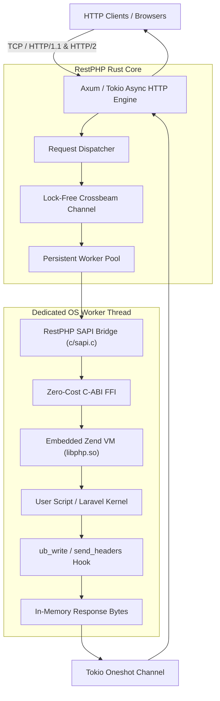

<HeroTerminal />

<BenchmarkChart />

<ScenarioCards />

---

## Core Pillars & Capabilities

<div class="features-grid">
  <div class="feature-card">
    <div class="feature-icon"></div>
    <h3 class="feature-title">Zero-Cost C-FFI</h3>
    <p class="feature-desc">Directly embeds Zend Engine via raw C-ABI (<code>extern "C"</code>). Eliminates ~60ns cgo stack-switching overhead present in Go-based servers.</p>
  </div>
  <div class="feature-card">
    <div class="feature-icon"></div>
    <h3 class="feature-title">Zero Host Garbage Collection</h3>
    <p class="feature-desc">Rust compile-time ownership (RAII) manages server memory. No Stop-The-World pauses; guarantees ultra-predictable p99 tail latency.</p>
  </div>
  <div class="feature-card">
    <div class="feature-icon"></div>
    <h3 class="feature-title">Persistent Worker Architecture</h3>
    <p class="feature-desc">Dedicated OS threads host isolated Zend VM instances. Boots your app once into RAM; zero file-reloading overhead on incoming requests.</p>
  </div>
  <div class="feature-card">
    <div class="feature-icon"></div>
    <h3 class="feature-title">1st-Class Laravel Octane Driver</h3>
    <p class="feature-desc">Official adapter package (<code>restphp/octane</code>). Supercharge existing Laravel applications up to 10x throughput with zero code changes.</p>
  </div>
  <div class="feature-card">
    <div class="feature-icon"></div>
    <h3 class="feature-title">Single Standalone Binary</h3>
    <p class="feature-desc">Shipped as a single static executable (<code>restphp</code>). No Nginx, PHP-FPM, or Caddy configuration required.</p>
  </div>
  <div class="feature-card">
    <div class="feature-icon"></div>
    <h3 class="feature-title">100% PHP Extension Compatible</h3>
    <p class="feature-desc">Works seamlessly with all native PHP extensions (PDO, MySQL, Redis, OPcache, cURL) without dangerous coroutine monkey-patching.</p>
  </div>
</div>

---

## One Minute with RestPHP

Install, build, and serve any PHP application in seconds:

::: code-group

```bash [Single Command Startup]
# Just run restphp — auto-detects Laravel, public/index.php, or index.php!
restphp
```

```bash [Laravel Octane]
# Install official RestPHP adapter
composer require restphp/octane

# Start persistent Laravel server
php artisan octane:restphp --port 8000
```

```bash [CLI Evaluation]
# Execute PHP code directly in-memory from terminal
restphp -e 'echo "PHP Version: " . PHP_VERSION . "\n";'
```


:::

---

## Architecture Overview



---

## Architectural Comparison

Why does RestPHP outperform Go and C++ alternatives?

```mermaid
graph LR
    subgraph FrankenPHP_Go ["FrankenPHP (Go)"]
        HTTP1[HTTP Request] --> Caddy[Caddy / Go]
        Caddy -- "cgo stack-switch (~60ns)" --> Zend1[Zend Engine]
        GC1["Go GC (STW Pause) + PHP GC"]
    end

    subgraph RestPHP_Rust ["RestPHP (Rust)"]
        HTTP2[HTTP Request] --> Tokio[Tokio Async / Axum]
        Tokio -- "Zero-Cost C ABI (0ns)" --> Zend2[Persistent Zend VM]
        GC2["Zero Host GC (Compile-time RAII)"]
    end

    style RestPHP_Rust fill:#1e293b,stroke:#f97316,stroke-width:3px
    style FrankenPHP_Go fill:#1e293b,stroke:#64748b,stroke-width:1px
```



---

<div class="cta-banner">

### Ready to build the future of PHP?

Join the revolution. Say goodbye to slow cold boots and unpredictable GC pauses.

[Get Started with RestPHP →](/guide/getting-started){.btn-primary}
[View Source on GitHub ★](https://github.com/arsyadal/restphp){.btn-secondary}

</div>

<style>
.benchmark-hero-container {
  margin: 3rem 0;
  padding: 1.5rem;
  background: var(--vp-c-bg-soft);
  border-radius: 12px;
  border: 1px solid var(--vp-c-divider);
}

.cta-banner {
  text-align: center;
  padding: 3rem 1rem;
  margin: 3rem 0;
  background: radial-gradient(circle at 50% 50%, rgba(249, 115, 22, 0.12) 0%, transparent 70%);
  border-radius: 16px;
  border: 1px solid rgba(249, 115, 22, 0.25);
}

.btn-primary {
  display: inline-block;
  padding: 0.75rem 1.75rem;
  margin: 0.5rem;
  border-radius: 8px;
  background: #f97316;
  color: white !important;
  font-weight: 600;
  text-decoration: none;
  transition: all 0.2s;
}

.btn-primary:hover {
  background: #ea580c;
  transform: translateY(-1px);
}

.btn-secondary {
  display: inline-block;
  padding: 0.75rem 1.75rem;
  margin: 0.5rem;
  border-radius: 8px;
  background: var(--vp-c-bg-soft);
  color: var(--vp-c-text-1) !important;
  border: 1px solid var(--vp-c-divider);
  font-weight: 600;
  text-decoration: none;
  transition: all 0.2s;
}

.btn-secondary:hover {
  border-color: #f97316;
  transform: translateY(-1px);
}

.features-grid {
  display: grid;
  grid-template-columns: repeat(auto-fit, minmax(280px, 1fr));
  gap: 1.5rem;
  margin: 2rem 0;
}

.feature-card {
  background: var(--vp-c-bg-soft);
  border: 1px solid var(--vp-c-divider);
  border-radius: 12px;
  padding: 1.5rem;
  transition: all 0.2s ease;
}

.feature-card:hover {
  border-color: rgba(249, 115, 22, 0.4);
  transform: translateY(-2px);
}

.feature-icon {
  width: 44px;
  height: 44px;
  background: rgba(249, 115, 22, 0.1);
  border: 1px solid rgba(249, 115, 22, 0.25);
  border-radius: 10px;
  display: flex;
  align-items: center;
  justify-content: center;
  margin-bottom: 1rem;
}

.feature-icon img {
  width: 24px;
  height: 24px;
}

.feature-title {
  font-size: 1.1rem;
  font-weight: 700;
  margin: 0 0 0.5rem 0;
  color: var(--vp-c-text-1);
}

.feature-desc {
  font-size: 0.9rem;
  line-height: 1.55;
  color: var(--vp-c-text-2);
  margin: 0;
}
</style>
