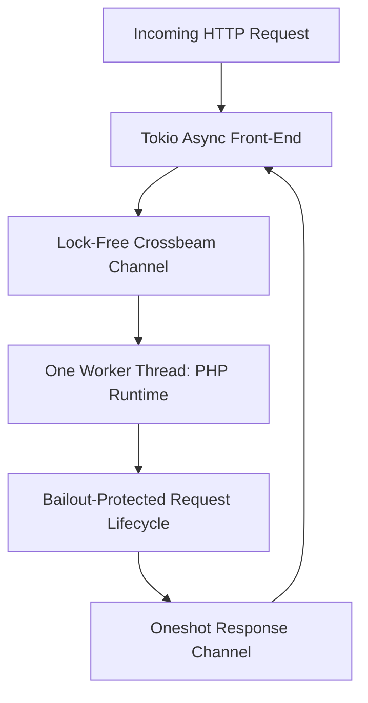

# Persistent Worker Architecture

RestPHP runs one embedded PHP runtime per process and performs PHP request startup and shutdown for each HTTP request. This is the supported production model for the current non-thread-safe (NTS) PHP build.

---

## The Cold Boot Bottleneck in Traditional PHP

In standard PHP deployments (such as Nginx + PHP-FPM or Apache `mod_php`), every HTTP request causes the web server to:
1. Spawn or reuse a PHP process.
2. Initialize the Zend VM engine.
3. Parse and execute `composer/autoload.php` and thousands of framework class files.
4. Bootstrap framework service containers, configurations, and route dispatchers.
5. Execute the business logic and send the response.
6. Destroy the entire VM state, free memory, and tear down the request.

This cycle means that **over 70% of CPU time is wasted re-bootstrapping frameworks**, restricting typical PHP-FPM servers to only a few hundred requests per second.

---

## The RestPHP Runtime Model

RestPHP keeps the embedded PHP runtime available in one dedicated worker thread. Incoming requests are admitted through a bounded queue, then execute a complete PHP request lifecycle. NTS PHP has process-global state, so `--workers` is intentionally limited to `1`; scale horizontally with multiple RestPHP processes behind a supervisor or load balancer.



---

## Worker Recycling (`--max-requests`)

While persistent execution offers massive performance gains, poorly written userland PHP code or third-party packages might have subtle memory leaks in static properties.

RestPHP can ask an external supervisor to recycle the process:
```bash
# Request a graceful process drain after 10,000 requests
restphp --max-requests 10000

# Run with unlimited worker lifetime
restphp --max-requests 0
```

When the process reaches its request limit:
1. It completes its current in-flight request cleanly.
2. It stops admitting new requests and drains work already accepted.
3. It exits successfully; systemd, a container orchestrator, or another process supervisor starts a replacement.
