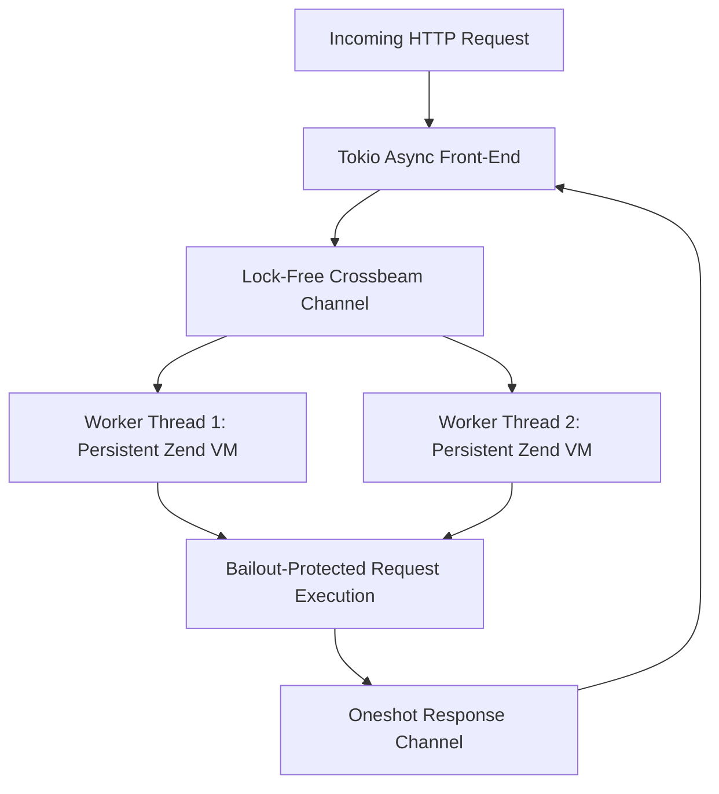

# Persistent Worker Architecture

RestPHP replaces the traditional, costly per-request process creation model with a **persistent worker architecture** written in Rust.

---

## The Cold Boot Bottleneck in Traditional PHP

In standard PHP deployments (such as Nginx + PHP-FPM or Apache `mod_php`), every HTTP request causes the web server to:
1. Spawn or reuse a PHP process.
2. Initialize the Zend VM engine.
3. Parse and execute `composer/autoload.php` and thousands of framework class files.
4. Bootstrap framework service containers, configurations, and route dispatchers.
5. Execute the business logic and send the response.
6. Destroy the entire VM state, free memory, and tear down the request.

This cycle means that **over 70% of CPU time is wasted re-bootstrapping frameworks**, restricting typical PHP-FPM servers to only a few hundred requests per second.

---

## The RestPHP Persistent Model

RestPHP reverses this paradigm:
- **Boot Once in RAM**: Framework code (like Laravel, Symfony, or custom applications) is loaded into the Zend VM's memory space once during server initialization.
- **Persistent OS Worker Threads**: Dedicated OS threads maintain active Zend VM instances.
- **Request Dispatch Queue**: Incoming HTTP requests received by the asynchronous Tokio/Axum front-end are dispatched across lock-free crossbeam channels directly to waiting worker actors.
- **Zero Framework Reloading**: Consecutive requests execute directly against the already-booted application in memory, yielding tens of thousands of requests per second.



---

## Worker Recycling (`--max-requests`)

While persistent execution offers massive performance gains, poorly written userland PHP code or third-party packages might have subtle memory leaks in static properties.

RestPHP provides built-in worker recycling:
```bash
# Gracefully recycle worker after 10,000 requests (default)
restphp --max-requests 10000

# Run with unlimited worker lifetime
restphp --max-requests 0
```

When a worker reaches its request limit:
1. It completes its current in-flight request cleanly.
2. The Zend VM performs full module shutdown and garbage collection.
3. A fresh worker thread is spawned seamlessly without dropping incoming connections.
