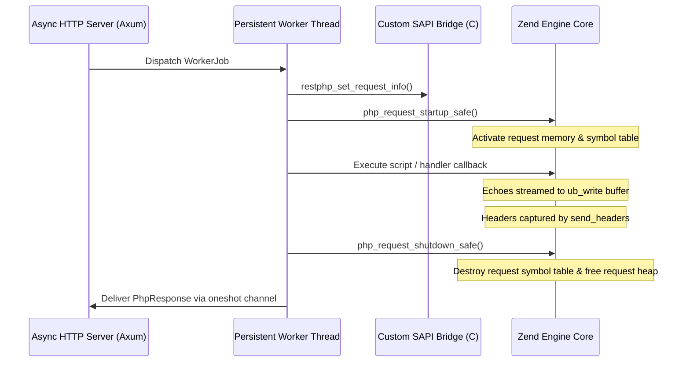

# Request Lifecycle & State Reset

In persistent application servers, the most critical architectural requirement is **preventing memory and state leakage across consecutive requests**.

---

## The Request Lifecycle Pipeline

For every HTTP request handled by a persistent worker, RestPHP orchestrates the following strict lifecycle:

---

## State Isolation Guarantees

RestPHP guarantees strict request isolation:

1. **Superglobal Teardown**:
   Between requests, `$_GET`, `$_POST`, `$_SERVER`, and `$_COOKIE` are destroyed and recreated with clean request scopes.
2. **Global Variable Deallocation**:
   Any global variables defined in userland scripts (e.g. `$GLOBALS['foo']`) are discarded when `php_request_shutdown()` runs.
3. **Bailout Protection**:
   If a userland script calls `exit()`, `die()`, or triggers a PHP fatal error, RestPHP intercepts the Zend Engine longjmp bailout via `zend_first_try` and `zend_catch`. The worker thread recovers gracefully and serves subsequent requests without crashing the server process.

---

## Verified by 60/60 E2E Test Suite

State reset and memory isolation are verified by RestPHP's automated test suite:
- **Tier 1 Lifecycle Tests**: Consecutive requests verify zero cross-request query leakage.
- **Tier 2 Boundary Tests**: Rapid alternating HTTP methods (GET, POST, PUT, DELETE) transition cleanly.
- **Tier 4 Stress Tests**: 100 concurrent requests across 10 threads verify zero memory corruption or symbol leakage.
