# Zero Host GC & Deterministic Latency

One of the foundational design choices of RestPHP is the **complete elimination of host runtime garbage collection**.

---

## The "Double GC" Problem in Go-based Runtimes

Modern persistent PHP application servers such as **FrankenPHP** and **RoadRunner** are written in Go. While Go provides high concurrency through goroutines, its memory management relies on a concurrent **Stop-The-World (STW) Garbage Collector**.

When running high-throughput web workloads:
1. **PHP's Cyclic GC**: The PHP Zend Engine has its own garbage collector (`zend_gc_collect_cycles`) to clean up circular references in userland variables.
2. **Go's Host GC**: The host server (Go) continuously allocates temporary memory buffers for HTTP headers, TCP buffers, and request routing, triggering periodic Go GC phases.

### Impact on p99 Tail Latency
During Go GC cycles, CPU cores are diverted to mark-and-sweep phases, and thread scheduling is briefly paused. This causes:
- **GC Jitter**: Periodic latency spikes where requests that normally take 2ms suddenly take 15ms or 40ms.
- **Unpredictable p99/p99.9 Latency**: Critical in enterprise microservices where SLA guarantees depend on consistent tail latency.

```mermaid
graph LR
    subgraph Go_Runtimes ["FrankenPHP / RoadRunner (Go)"]
        G1[Request Influx] --> G2[Double Garbage Collection]
        G2 --> G3["Go GC Pauses (STW) + Zend GC"]
        G3 --> G4["p99 Latency Jitter (4.8ms - 20ms)"]
    end

    subgraph Rust_RestPHP ["RestPHP (Rust)"]
        R1[Request Influx] --> R2[Compile-Time RAII Ownership]
        R2 --> R3["Zero Host Garbage Collection"]
        R3 --> R4["Flat, Deterministic p99 (1.2ms)"]
    end

    style Rust_RestPHP fill:#0f172a,stroke:#f97316,stroke-width:2px
    style Go_Runtimes fill:#0f172a,stroke:#64748b,stroke-width:1px
```

---

## The Rust Advantage: Compile-Time RAII

Rust does not have a runtime garbage collector:
- **Deterministic Destruction (RAII)**: Memory allocated for incoming requests, headers, and responses is freed the exact microsecond the variable falls out of scope.
- **No Background Sweepers**: Zero background CPU cycles are spent scanning heap pointers.
- **Rock-Solid Tail Latency**: Under sustained high-load concurrency benchmarks (100+ concurrent connections), RestPHP maintains an ultra-flat p99 latency curve of **~1.2 ms**.
